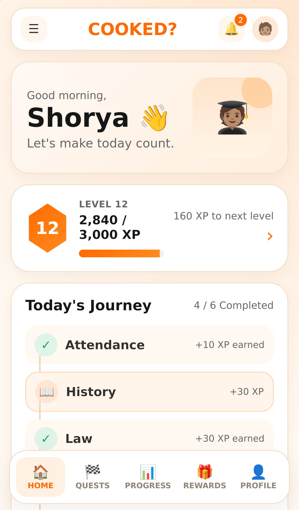
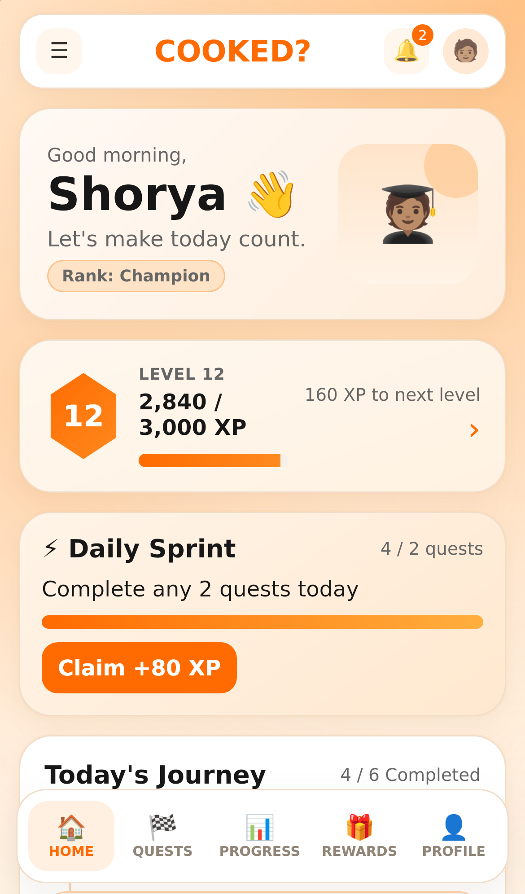

# COOKED? V1

COOKED? V1 is a focused daily student companion with:

- Attendance
- Goals (JEE / NEET daily question targets)
- Opportunities
- Daily History
- Daily Law
- Personalized Daily News
- Gamification: XP, streaks, levels, quests, daily challenge, milestones, achievements
- Suggestions / feedback
- About / support

## Before / After UI

| Before | After |
| --- | --- |
|  |  |

## Architecture (just add the APIs)

The frontend (`src/api/appApi.js`) talks only to the local Python backend
(`/api/*`). The backend fetches content from **free / public sources** and falls
back to curated offline content whenever a source is unreachable or not
configured — so the app always works, even with zero keys.

| Feature | Source | Key needed? |
| --- | --- | --- |
| History of the Day | Wikipedia "On this day" feed | No |
| Law ("Know the Con") | Local `backend/data/constitution.json` | No |
| News | NewsAPI **free tier** (or `NEWS_API_URL` override) | Optional (free key) |
| Opportunities | Curated list in `backend/app.py` | No |
| Attendance / Goals / Quest / XP | Backend + local store | No |

To plug in your own sources, copy `backend/.env.example` to `backend/.env` and
set `HISTORY_API_URL`, `NEWS_API_URL`, `NEWS_API_KEY`, and optionally the
Azure Cosmos DB values. No paid keys are required.

## Run locally

```bash
npm install
npm run dev        # frontend (Vite) — proxies /api to :3000
```

Run the backend in a second terminal:

```bash
\.venv\Scripts\python.exe backend\app.py
```

## Build

```bash
npm run build        # outputs to dist/ (served by the backend in production)
npm run preview
```

## Python backend

- `GET  /api/bootstrap` — full hydrated profile (content + state)
- `PUT  /api/attendance/today` — mark present/absent
- `PUT  /api/goals` / `POST /api/goals/progress` — daily question goals
- `POST /api/quests/:id/complete` — complete a quest, earn XP
- `POST /api/daily-challenge/claim` — claim the daily bonus
- `POST /api/feedback` — save a suggestion
- `POST /api/support` — save a help/support request
- `PUT  /api/profile` — update the display name

Install the optional Azure database client with:

```bash
\.venv\Scripts\python.exe -m pip install -r backend\requirements.txt
```
